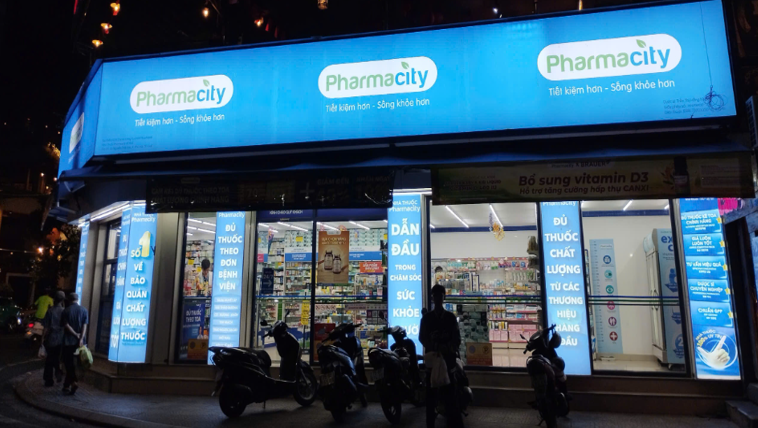

# NHAPMON_CNPM_NHOM-1_XD_HETHONG_QUANLY_NHATHUOC
Xây dựng hệ thống quản lý nhà thuốc giúp tự động hóa quy trình bán hàng, quản lý kho và thống kê doanh thu, nhằm hỗ trợ chủ nhà thuốc và nhân viên vận hành hiệu quả, chính xác và tuân thủ quy định dược phẩm.

## Giới thiệu Thành viên nhóm:
---

### 1. Họ và tên:
**Mai Đăng Khoa**

---

### 📞 Thông tin liên hệ:
- **Email:** khoamai2912@gmail.com  
- **Facebook:** [Mai Đăng Khoa](https://www.facebook.com/khoamai0402/)
- **Github:** [khoamai291299](https://github.com/khoamai291299)

### 2. Họ và tên:
**NGUYỄN THỊ HẰNG**

---

### 🖼️ Ảnh đại diện:

---

### 📞 Thông tin liên hệ:
- **Email:** nthang59205@gmail.com 
- **Số điện thoại:** 0394 235 205
- **Facebook:** [N.T.Hằng](https://web.facebook.com/n.t.hang2005)

### 3. Họ và tên:
**Nguyễn Thị Hiền**

---

### 🖼️ Ảnh đại diện:

---

### 📞 Thông tin liên hệ:
- **Email:** hienng250104@gmail.com   
- **Số điện thoại:** 032 982 4325  
- **Facebook:** [Nguyễn Thị Hiền ](https://www.facebook.com/nt.hien.915374)

### 4. Họ và tên:
**Nguyễn Hữu Thành**

---

### 🖼️ Ảnh đại diện:

---

### 📞 Thông tin liên hệ:
- **Email:** nguyenhuuthanh2k6@gmail.com 
- **Số điện thoại:** 0855593455
- **Facebook:** [Nguyễn Hữu Thành](https://www.facebook.com/share/17S4EhfzoZ/)

### 5. Họ và tên:
**Lê Anh Đức**
### 🖼️ Ảnh đại diện:

### 📞 Thông tin liên hệ:
- **Email:** leanhduccpr2000@gmail.com
- **Số điện thoại:** 0378136469
- **Facebook:** https://web.facebook.com/le.uc.865296

### 6. Họ và tên:
**Nguyễn Thùy Dương**

---

### 🖼️ Ảnh đại diện:

---

### 📞 Thông tin liên hệ:
- **Email:** dun.310205@gmail.com 
- **Số điện thoại:** 0968312080
- **Facebook:** [Nguyễn Thùy Dương](https://web.facebook.com/duongdangbanngu/)

## Hình ảnh cửa hàng thực hiện khảo sát:

## Mô tả hệ thống 
---

### 1.Mục tiêu dự án:
- **Quản lý thông tin thuốc (tên thuốc, giá, hạn sử dụng, nhà cung cấp…)**
- **Theo dõi số lượng tồn kho theo thời gian thực**
- **Quản lý hóa đơn bán hàng**
- **Tra cứu nhanh thuốc theo mã hoặc tên**
- **Quản lý nhân viên, phân quyền người dùng**
- **Báo cáo doanh thu, hàng sắp hết, hàng hết hạn**

### 2.Chức năng chính:
- **Quản lý thuốc:** Thêm/sửa/xoá thuốc, quản lí danh mục thuốc,cảnh báo thuốc sắp hết hạn
- **Quản lí bán hàng:** Tạo hoá đơn,tổng tiền,giảm giá, tự động trừ kho
- **Quản lí kho:** Nhập hàng từ nhà cung cấp,thống kê số lượng tồn
- **Quản lí khách hàng:** tạo tài khoản đăng nhập, lưu thông tin khách hàng và phân loại khách hàng.
- **Báo cáo:** Doanh thu,thuốc tồn kho,thuốc hết hạn, hiệu suất nhân viên.

## Mô hình quan hệ

---

##	Giao diện
---

### 1.Giao diện quản trị viên
- **Quản lí nhân viên:** thêm,xoá,sửa thông tin nhân viên,lương,chức vụ 
- **Thống kê hoạt động nhân viên:** ngày làm, ngày nghỉ của nhân viên
- **Thống kê doanh thu lợi nhuận theo ngày,tháng,quý,năm**
### 2.Giao diện cho nhân viên
- **Trang chủ:** ( doanh thu ngày, hàng tồn, cảnh báo thuốc sắp hết hạn)
- **Quản lí thuốc, sản phẩm, nhà cung cấp, đơn hàng**
- **Giao diện bán hàng, lập hoá đơn:** Nhập thông tin khách hàng, hiển thị thông tin tổng tiền, có thể nhập hoặc tra mã thuốc, chọn loại hình thanh toán.
- **Cung cấp báo cáo doanh thu, lợi nhuận, lượng tồn kho**
- **Hoá đơn với đối tượng khách hàng mua online**
- **Hoá đơn với đối tượng mua trực tiếp**
- **Hoá đơn bao gồm :**
    + **Nhà thuốc:** Tên nhà thuốc, địa chỉ, số điện thoại ,mã nhà thuốc
    + **Khách hàng:** Hạng thành viên, tên khách hàng, điểm thành viên
    + **Tên nhân viên thu ngân,ngày, giờ xuất hoá đơn**
    + **Thuốc, sản phẩm:** tên, số lượng,đơn giá, khuyến mại, ngày hết hạn thuốc,thành tiền,phương thức thanh toán
    + **Các thông tin tra cứu, hotline, mã vạch**
### 3.Giao diện khách hàng:
- **Các mục tra cứu thông tin thuốc, bệnh, thực phẩm bảo vệ sức khỏe, chăm sóc cá nhân, …**
- **Thanh tìm kiếm sản phẩm: Một số loại sản phẩm được tìm kiếm thông dụng**
- **Danh mục sản phẩm**
- **Đăng nhập/ đăng kí thành viên**
- **Giỏ hàng và đặt hàng**
- **Mục khuyến mãi và thông báo**
--

## 4	Quy định

--
### 1. Quy định về quản lí thuốc
̶- Sản phẩm lưu hành phải có số đăng ký hợp lệ của Bộ Y tế.
̶- Mỗi lô thuốc nhập đều có thông tin về số lô, hạn dùng, nơi sản xuất được lưu trong hệ thống.
̶- Thuốc bán theo toa phải được kiểm tra, đối chiếu thông tin trước khi bán.
̶	Hệ thống không cho phép bán các thuốc đã hết hạn hoặc bị thu hồi.
### 2. Quy định về dữ liệu và người dùng
Phải bảo mật và lưu mọi hoạt động để theo dõi sát sao từng thao tác
### 3. Quy định về chính sách ưu đãi và đổi trả

### - Chính sách đổi trả

- Thuốc đã mua thì không được đổi trả trừ trường hợp nhầm đơn hoặc lỗi do nhà sản xuất
- Điều kiện đổi trả:
  - Còn nguyên bao bì
  - Có hóa đơn
  - Trong thời gian quy định

### - Chính sách ưu đãi

#### Hạng thành viên

Khách hàng có 3 hạng thành viên:
- *Vàng*
- *Kim cương*
- *Bạch kim*

#### Điều kiện trở thành thành viên

- Cần đăng ký tài khoản
- Các hạng được phân cấp dựa trên:
  - Tổng giá trị đơn hàng
  - Điểm tích lũy theo quy định
- Mức hạng thành viên càng cao → nhận được càng nhiều ưu đãi

#### Hệ thống điểm P-Xu

*Tỷ lệ quy đổi:*
- 1 P-Xu vàng = 1 VNĐ

*Tỷ lệ sử dụng:*
- P-Xu được dùng để thanh toán lên đến tối đa *50%* tổng giá trị các sản phẩm sau khuyến mại
- Sử dụng với bội số của *5.000 VNĐ*

*Lưu ý:*
- Không áp dụng cho dịch vụ thẻ điện thoại

## Phân tích yêu cầu:
- **Dựa vào thông tin mô tả hệ thống đã tìm hiểu, ta tiến hành phân tích yêu cầu nhằm xác định chức năng, đối tượng sử dụng, dữ liệu cần quản lý. Từ đó, xây dựng Hệ thống Quản lý Nhà thuốc đảm bảo tính hiệu quả, hợp lý, chính xác và thuận tiện.**

Cửa hàng quản lý nhiều sản phẩm thuốc khác nhau. Các sản phẩm Thuốc được phân biệt với nhau cụ thể thông qua Mã thuốc. Bên cạnh đó, thông tin thuốc gồm có: tên thuốc, hàm lượng, hoạt chất, thời gian nhập, ngày sản xuất, ngày hết hạn, đơn vị, số lượng, giá nhập, giá bán. Mỗi sản phẩm thuốc cũng được phân loại vào các nhóm khác nhau như: Thực phẩm bổ sung, Vitamin, Sản phẩm cho mẹ và bé,… Một sản phẩm do một nhà sản xuất nhất định cung cấp. Mỗi nhà sản xuất có thể sản xuất nhiều sản phẩm thuốc khác nhau. Thông tin nhà sản xuất gồm có: mã nhà sản xuất, tên nhà sản xuất, địa chỉ, quốc gia.

Cửa hàng được vận hành và quản lý bởi các nhân viên. Các nhân viên được phân biệt với nhau thông qua: mã nhân viên, họ tên, ngày sinh, giới tính, số điện thoại, địa chỉ, ngày bắt đầu làm, lương. Mỗi nhân viên thuộc 1 bộ phận nhất định và có chức vụ nhất định. Hoạt động làm việc hằng ngày của nhân viên được ghi nhận lại thông qua chấm công, bao gồm: thông tin nhân viên cần chấm công, số ngày làm, số ngày nghỉ và lịch chấm công. Lịch chấm công được xác định dựa vào mã lịch, tháng đang chấm công và năm đang chấm công

Việc nhập kho do nhân viên kho đảm nhiệm. Mỗi lần nhập kho, nhân viên cần phải điền phiếu nhập kho. Phiếu nhập kho gồm các thông tin: Mã phiếu nhập kho, nhân viên nhập kho, ngày nhập kho, danh sách các sản phẩm thuốc nhập kho, số lượng nhập của từng sản phẩm, đơn giá nhập của từng sản phẩm, ngày sản xuất, ngày hết hạn của từng sản phẩm và cuối cùng là tổng tiền nhập.

Nhân viên bán hàng, chịu trách nhiệm bán thuốc cho các khách hàng. Mỗi khách hàng được lưu lại những thông tin: mã khách hàng, họ tên khách hàng, số điện thoại, địa chỉ, tổng chi, điểm tích luỹ. Khách hàng cũng được phân loại theo các bậc hạn mức chi tiêu khác nhau. Ở mỗi bậc sẽ có các ưu đãi riêng biệt. Bậc bạc: Ưu đãi 5%, Bậc vàng ưu đãi 10%, Bậc kim cương Ưu đãi 20%,…

Mỗi lần mua thuốc, khách hàng được nhân viên bán hàng cung cấp hoá đơn. Mỗi hoá đơn bao gồm thông tin: Mã hóa đơn, ngày lập, nhân viên bán hàng, tên khách hàng, danh sách các sản phẩm, số lượng mua cho từng sản phẩm và tổng tiền khách hàng phải thanh toán.
--

## Phạm vi và đối tượng sử dụng
- Đối tượng sử dụng:
  + Quản trị viên (Admin)
  + Nhân viên bán hàng
  + Nhân viên kho
- Phạm vi hệ thống:
  + Quản lý thuốc
  + Quản lý kho
  + Quản lý khách hàng & nhà cung cấp
  + Quản lý bán hàng
  + Quản lý nhập hàng
  + Báo cáo thống kê
--

## Yêu cầu phi chức năng
- Tính bảo mật
  + Người dùng phải đăng nhập mới sử dụng được hệ thống.
  + Mỗi chức năng chỉ được phép truy cập theo vai trò.
- Tính khả dụng
  + Giao diện thân thiện, dễ dùng.
  + Hoạt động ổn định, tốc độ xử lý nhanh.
- Tính mở rộng
  + Hỗ trợ thêm tính năng mới như kết nối API Dược Quốc Gia
