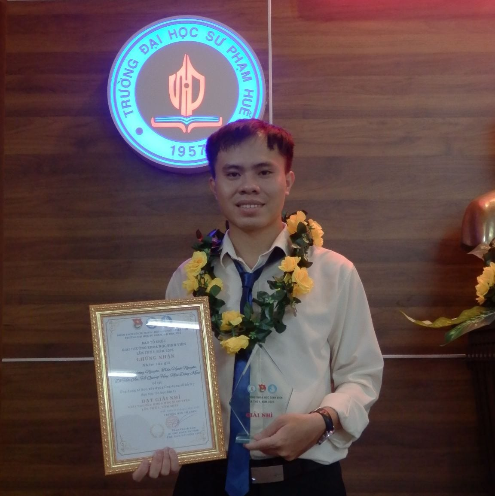

# NHAPMON_CNPM_NHOM-1_XD_HETHONG_QUANLY_NHATHUOC
Xây dựng hệ thống quản lý nhà thuốc giúp tự động hóa quy trình bán hàng, quản lý kho và thống kê doanh thu, nhằm hỗ trợ chủ nhà thuốc và nhân viên vận hành hiệu quả, chính xác và tuân thủ quy định dược phẩm.

## Giới thiệu Thành viên nhóm:
---

### 1. Họ và tên:
**Mai Đăng Khoa**

---

### 🖼️ Ảnh đại diện:

---

### 📞 Thông tin liên hệ:
- **Email:** khoamai2912@gmail.com  
- **Số điện thoại:** 085 962 9889  
- **Facebook:** [Mai Đăng Khoa](https://www.facebook.com/khoamai0402/)

### 2. Họ và tên:
**NGUYỄN THỊ HẰNG**

---

### 🖼️ Ảnh đại diện:

---

### 📞 Thông tin liên hệ:
- **Email:** nthang59205@gmail.com 
- **Số điện thoại:** 0394 235 205
- **Facebook:** [N.T.Hằng](https://web.facebook.com/n.t.hang2005)

### 3. Họ và tên:
**Nguyễn Thị Hiền**

---

### 🖼️ Ảnh đại diện:

---

### 📞 Thông tin liên hệ:
- **Email:** hienng250104@gmail.com  
- **Số điện thoại:** 032 982 4325  
- **Facebook:** [Nguyễn Thị Hiền ](https://www.facebook.com/nt.hien.915374)

### Thong tin them