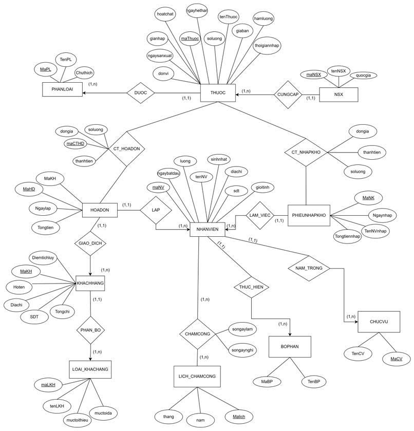

# NHAPMON_CNPM_NHOM-1_XD_HETHONG_QUANLY_NHATHUOC
Xây dựng hệ thống quản lý nhà thuốc giúp tự động hóa quy trình bán hàng, quản lý kho và thống kê doanh thu, nhằm hỗ trợ chủ nhà thuốc và nhân viên vận hành hiệu quả, chính xác và tuân thủ quy định dược phẩm.

## Giới thiệu Thành viên nhóm:
---

### 1. Họ và tên:
**Mai Đăng Khoa**

---

### 🖼️ Ảnh đại diện:

---

### 📞 Thông tin liên hệ:
- **Email:** khoamai2912@gmail.com  
- **Số điện thoại:** 085 962 9889  
- **Facebook:** [Mai Đăng Khoa](https://www.facebook.com/khoamai0402/)

### 2. Họ và tên:
**NGUYỄN THỊ HẰNG**

---

### 🖼️ Ảnh đại diện:

---

### 📞 Thông tin liên hệ:
- **Email:** nthang59205@gmail.com 
- **Số điện thoại:** 0394 235 205
- **Facebook:** [N.T.Hằng](https://web.facebook.com/n.t.hang2005)

### 3. Họ và tên:
**Nguyễn Thị Hiền**

---

### 🖼️ Ảnh đại diện:

---

### 📞 Thông tin liên hệ:
- **Email:** hienng250104@gmail.com   
- **Số điện thoại:** 032 982 4325  
- **Facebook:** [Nguyễn Thị Hiền ](https://www.facebook.com/nt.hien.915374)

### 4. Họ và tên:
**Nguyễn Hữu Thành**

---

### 🖼️ Ảnh đại diện:

---

### 📞 Thông tin liên hệ:
- **Email:** nguyenhuuthanh2k6@gmail.com 
- **Số điện thoại:** 0855593455
- **Facebook:** [Nguyễn Hữu Thành](https://www.facebook.com/share/17S4EhfzoZ/)

### 5. Họ và tên:
**Lê Anh Đức**
### 🖼️ Ảnh đại diện:

### 📞 Thông tin liên hệ:
- **Email:** leanhduccpr2000@gmail.com
- **Số điện thoại:** 0378136469
- **Facebook:** https://web.facebook.com/le.uc.865296

### 6. Họ và tên:
**Nguyễn Thùy Dương**

---

### 🖼️ Ảnh đại diện:

---

### 📞 Thông tin liên hệ:
- **Email:** dun.310205@gmail.com 
- **Số điện thoại:** 0968312080
- **Facebook:** [Nguyễn Thùy Dương](https://web.facebook.com/duongdangbanngu/)

#### Mô tả hệ thống 
- **Mục tiêu dự án:**
    + **Quản lý thông tin thuốc (tên thuốc, giá, hạn sử dụng, nhà cung cấp…)**
    + **Theo dõi số lượng tồn kho theo thời gian thực**
    + **Quản lý hóa đơn bán hàng**
    + **Tra cứu nhanh thuốc theo mã hoặc tên**
    + **Quản lý nhân viên, phân quyền người dùng**
    + **Báo cáo doanh thu, hàng sắp hết, hàng hết hạn**
- **Chức năng chính:**
    + **Quản lý thuốc:** Thêm/sửa/xoá thuốc, quản lí danh mục thuốc,cảnh báo thuốc sắp hết hạn
    + **Quản lí bán hàng:** Tạo hoá đơn,tổng tiền,giảm giá, tự động trừ kho
    + **Quản lí kho:** Nhập hàng từ nhà cung cấp,thống kê số lượng tồn
    + **Quản lí khách hàng:** tạo tài khoản đăng nhập, lưu thông tin khách hàng và phân loại khách hàng.
    + **Báo cáo:** Doanh thu,thuốc tồn kho,thuốc hết hạn, hiệu suất nhân viên.

### Mô hình quan hệ

