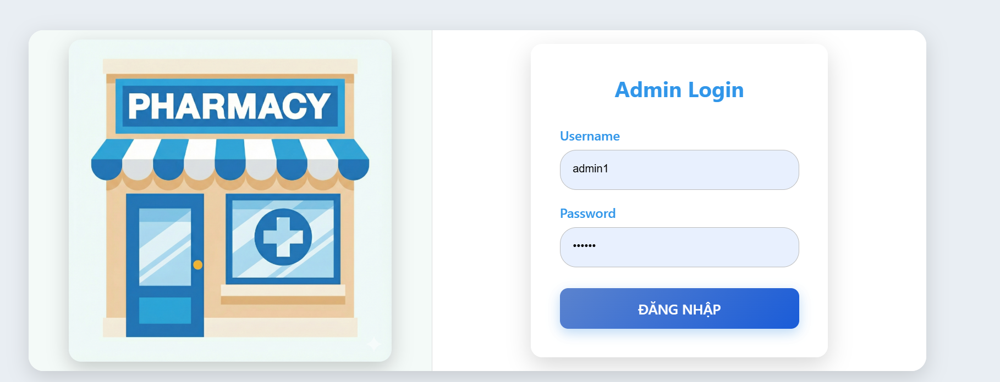
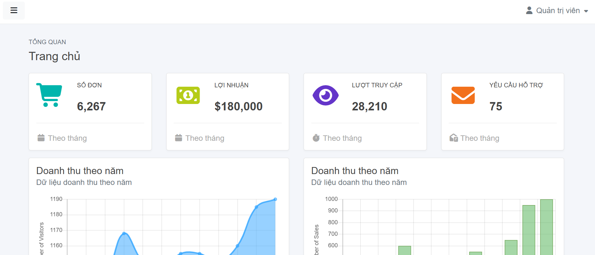
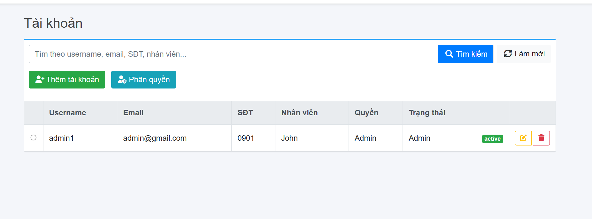

# NHẬP MÔN CÔNG NGHỆ PHẦN MỀM  
## XÂY DỰNG HỆ THỐNG QUẢN LÝ NHÀ THUỐC  
**Nhóm 1**
### 1. Họ và tên:
**Mai Đăng Khoa**
---
### 📞 Thông tin liên hệ:

- **Email:** khoamai2912@gmail.com  
- **Github:** [khoamai291299](https://github.com/khoamai291299)

### 2. Họ và tên:
**Nguyễn Thị Hằng**
---

- **Email:** nthang59205@gmail.com 
- **Số điện thoại:** 0394 235 205

### 3. Họ và tên:
**Nguyễn Thị Hiền**
---

- **Email:** hienng250104@gmail.com   
- **Số điện thoại:** 032 982 4325  

### 4. Họ và tên:
**Nguyễn Hữu Thành**
---

- **Email:** nguyenhuuthanh2k6@gmail.com 
- **Số điện thoại:** 0855593455

### 5. Họ và tên:
**Lê Anh Đức**
---
- **Email:** leanhduccpr2000@gmail.com
- **Số điện thoại:** 0378136469

### 6. Họ và tên:
**Nguyễn Thùy Dương**
---

### 📞 Thông tin liên hệ:
- **Email:** dun.310205@gmail.com 
- **Số điện thoại:** 0968312080
---

## 1. Giới thiệu dự án
Dự án **Hệ thống quản lý nhà thuốc** được xây dựng hệ thống quản lý nhà thuốc giúp tự động hóa quy trình bán hàng, quản lý kho và thống kê doanh thu, nhằm hỗ trợ chủ nhà thuốc và nhân viên vận hành hiệu quả, chính xác và tuân thủ quy định dược phẩm.
**Nhập môn Công nghệ Phần mềm**.  
Hệ thống nhằm hỗ trợ các nhà thuốc trong việc quản lý thuốc, khách hàng, nhân viên và hóa đơn một cách khoa học, chính xác và hiệu quả, thay thế cho phương pháp quản lý thủ công truyền thống.

Thông qua dự án, nhóm vận dụng các kiến thức đã học về:
- Phân tích yêu cầu phần mềm
- Thiết kế hệ thống
- Tổ chức và quản lý mã nguồn
- Xây dựng ứng dụng web cơ bản

---

## 2. Mục tiêu của dự án
- Xây dựng một hệ thống quản lý nhà thuốc ở mức cơ bản
- Hỗ trợ quản lý dữ liệu thuốc, khách hàng và nhân viên
- Tự động hóa quy trình bán thuốc và lập hóa đơn
- Giảm sai sót trong quản lý và thống kê
- Rèn luyện kỹ năng làm việc nhóm và phát triển phần mềm

## 3. Phạm vi dự án
Hệ thống tập trung vào các chức năng cốt lõi phục vụ hoạt động của một nhà thuốc nhỏ ,vừa và có thể ở các chuỗi của hàng bao gồm:
- Quản lý sản phẩm 
- Quản lý loại sản phẩm 
- Quản lý khách hàng
- Quản lý nhân viên
- Quản lý hóa đơn bán thuốc
- Thống kê và báo cáo cơ bản
## 4. Các chức năng chính của hệ thống
### 4.1. Quản lý thuốc
- Thêm, sửa, xóa thông tin thuốc
- Quản lý số lượng tồn kho
- Quản lý giá bán và hạn sử dụng
- Tìm kiếm thuốc theo tên hoặc loại thuốc
---
### 4.2. Quản lý khách hàng
- Lưu trữ thông tin khách hàng
- Cập nhật và chỉnh sửa thông tin khách hàng
- Tìm kiếm khách hàng nhanh chóng
---
### 4.3. Phân loại khách hàng
- Phân loại khách hàng theo từng nhóm (khách hàng thường, khách hàng thân thiết)
- Áp dụng chính sách ưu đãi theo loại khách hàng
---
### 4.4. Quản lý nhân viên
- Quản lý thông tin nhân viên
- Phân quyền cơ bản cho nhân viên
---
### 4.5. Quản lý hóa đơn
- Lập hóa đơn bán thuốc
- Tính tổng tiền tự động
- Lưu trữ lịch sử hóa đơn
- Tra cứu hóa đơn theo thời gian
---
### 4.6. Thống kê và báo cáo
- Thống kê doanh thu theo ngày, tháng
- Thống kê số lượng thuốc đã bán
- Hỗ trợ theo dõi tình hình kinh doanh
---
## 5. Công nghệ sử dụng
### 5.1. Backend
- Django (Python)
- Mô hình MVT ( Model – Template – View )
### 5.2. Frontend
- HTML
- Bootstrap
- CSS
- JavaScript
### 5.3. Cơ sở dữ liệu
- MySQL
### 5.4. Công cụ hỗ trợ
- Git, GitHub
- Visual Studio Code
---
## 6. Kiến trúc hệ thống
Hệ thống được xây dựng theo mô hình MVT:
- Người dùng thao tác trên giao diện web
- Server xử lý logic nghiệp vụ
- Dữ liệu được lưu trữ và quản lý trong cơ sở dữ liệu MySQL
---
## 7. Hướng dẫn cài đặt và chạy chương trình
**Bước 1. git clone https://github.com/khoamai291299/NHAPMON_CNPM_NHOM-1_XD_HETHONG_QUANLY_NHATHUOC.git**

**Bước 2: Cài đặt Python phiên bản 3.13.9**
link: https://www.python.org/downloads/release/python-3139/
- cd desktop
- py -m venv myenv // tạo môi trường ảo
- myenv\Scripts\activate.bat   // Kích hoạt môi trường
- pip install pymysql             // Kết nối py với mysql
- pip install django               // Framework Django
- pip install mysqlclient

# Kiểm tra phiên bản
py -m django --version

**Bước 3: Cài đặt Mysql**
	---- Thiết lập mật khẩu root là: 123456
**Bước 4: Mở mysql workbench**
- Tạo schemas: quanlynhathuocdb
**Bước 5 terminal 2 lệnh sau**
- py manage.py makemigrations       
- py manage.py migrate     
**Bước 6**
- Import file dữ liệu sau vào mysql
- https://drive.google.com/drive/folders/1T7lsYqgH_T8u2OCz_LfzqaAYV1Q4laVg?usp=drive_link

**chạy từng đoạn lệnh sau**
```python
python manage.py shell
from myapp.models import Users
from django.contrib.auth.hashers import make_password
u = Users(
    username='admin',
    password=make_password('123456'),
    email='admin@gmail.com',
    eid_id='EMP001',       # foreign key phải tồn tại
    role_id='ROL001',          # ví dụ role manager/seller/warehouse phải có trước
    status='active'
)
u.save()
quit()

**Bước 7**
- Vào lại terminal: py manage.py runserver
- Nhập username = admin
- Pass = 123456


## 7. Một số ảnh hệ thống quản lý nhà thuốc 

--- 

### 🖼️ Ảnh hệ thống:
****

---

---

